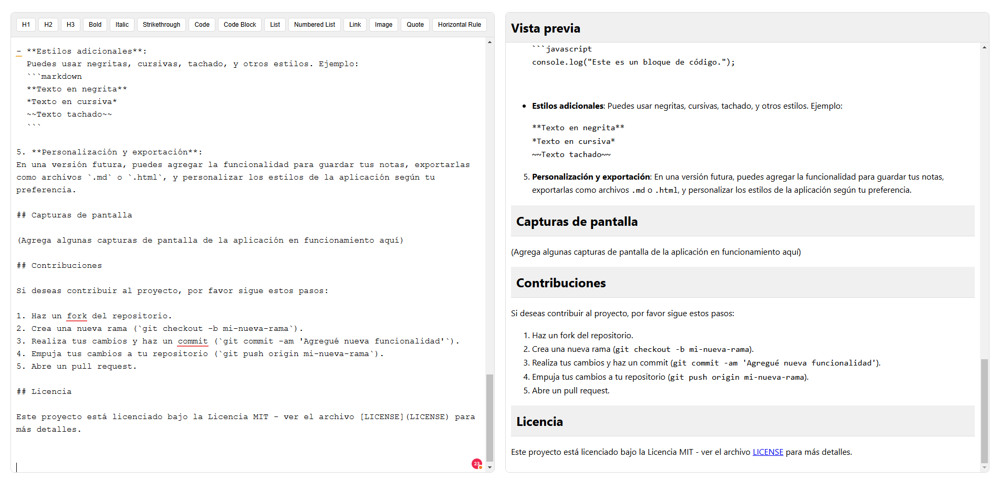

# Aplicación de Notas con Markdown

Una sencilla aplicación web que permite a los usuarios escribir notas utilizando sintaxis Markdown y ver una vista previa en tiempo real. Está diseñada para ser rápida, ligera y fácil de usar.

## Características

- **Editor de Markdown en tiempo real**: Los usuarios pueden escribir notas usando sintaxis Markdown y ver los resultados en una vista previa dinámica.
- **Soporte para formato Markdown**: La vista previa soporta diversos estilos de texto, como encabezados, listas, citas, enlaces, imágenes, código, etc.
- **Interfaz intuitiva**: La aplicación está diseñada para ser fácil de usar, con un diseño limpio y moderno.
- **Animaciones suaves**: Se implementaron animaciones y efectos de transición para mejorar la experiencia del usuario.

## Tecnologías

- **React.js**: Biblioteca de JavaScript para construir interfaces de usuario.
- **Vite**: Herramienta de construcción moderna y de alto rendimiento para el desarrollo de aplicaciones React.
- **Markdown.js**: Biblioteca que permite convertir texto en formato Markdown a HTML.
- **CSS**: Para el diseño y la personalización de la interfaz de usuario.

## Instalación

Sigue estos pasos para clonar y ejecutar el proyecto en tu máquina local:

1. **Clona el repositorio**:

   ```bash
   git clone https://github.com/tu-usuario/aplicacion-notas-markdown.git
   ```
2. **Navega al directorio del proyecto**:
   ```bash
   cd aplicacion-notas-markdown

   ```

3. **Instala las dependencias**:
   ```bash
   npm install
   ```
4. **Inicia el servidor de desarrollo**:

   ```bash
   npm run dev
   ```
Esto abrirá la aplicación en tu navegador en la direccion que te indica tu terminal:
   ```bash
   > markdown-notes@0.0.0 dev
   > vite


     VITE v6.0.7  ready in 1546 ms

     ➜  Local:   http://localhost:5173/
     ➜  Network: use --host to expose
     ➜  press h + enter to show help
   ```
## Uso

1. **Abrir la aplicación en el navegador**:
   Una vez que el servidor de desarrollo esté en ejecución, abre la aplicación en tu navegador. 


2. **Escribir en el editor de Markdown**:
Verás un área de texto donde puedes escribir tus notas usando sintaxis Markdown. A medida que vayas escribiendo, el contenido se actualizará automáticamente en la vista previa.

3. **Vista previa en tiempo real**:
La vista previa de tu texto se actualizará al instante para mostrarte cómo se vería el contenido con el formato Markdown. Esto te permitirá ver el resultado final sin tener que realizar ninguna acción adicional.

4. **Experimentar con sintaxis Markdown**:
Puedes probar varias características de Markdown, como:

- **Encabezados**:
  Usa `#` para crear encabezados de diferentes niveles. Por ejemplo:
  ```markdown
  # Título principal
  ## Título secundario
  ### Título terciario
  ```

- **Listas**:
  Crea listas con viñetas usando `-` o `*`, y listas numeradas con `1.`:
  ```markdown
  - Item 1
  - Item 2
  
  1. Primer item
  2. Segundo item
  ```

- **Citas**:
  Usa `>` para crear citas:
  ```markdown
  > Esta es una cita destacada.
  ```

- **Enlaces**:
  Crea enlaces con la sintaxis `[Texto del enlace](http://ejemplo.com)`:
  ```markdown
  [Visita Google](https://www.google.com)
  ```

- **Imágenes**:
  Inserta imágenes usando la sintaxis ``:
  ```markdown
  
  ```

- **Código en línea**:
  Usa las comillas invertidas para resaltar código en línea:
  ```markdown
  Aquí está el código: `console.log("Hola, mundo!");`
  ```

- **Bloques de código**:
  Usa tres comillas invertidas para bloques de código:
  ```markdown
  ```javascript
  console.log("Este es un bloque de código.");
  ```
  ```

- **Estilos adicionales**:
  Puedes usar negritas, cursivas, tachado, y otros estilos. Ejemplo:
  ```markdown
  **Texto en negrita**
  *Texto en cursiva*
  ~~Texto tachado~~
  ```

5. **Personalización y exportación**:
En una versión futura, puedes agregar la funcionalidad para guardar tus notas, exportarlas como archivos `.md` o `.html`, y personalizar los estilos de la aplicación según tu preferencia.

## Capturas de pantalla



## Contribuciones

Si deseas contribuir al proyecto, por favor sigue estos pasos:

1. Haz un fork del repositorio.
2. Crea una nueva rama (`git checkout -b mi-nueva-rama`).
3. Realiza tus cambios y haz un commit (`git commit -am 'Agregué nueva funcionalidad'`).
4. Empuja tus cambios a tu repositorio (`git push origin mi-nueva-rama`).
5. Abre un pull request.

## Licencia

Este proyecto está licenciado bajo la Licencia MIT - ver el archivo [LICENSE](LICENSE) para más detalles.

   
